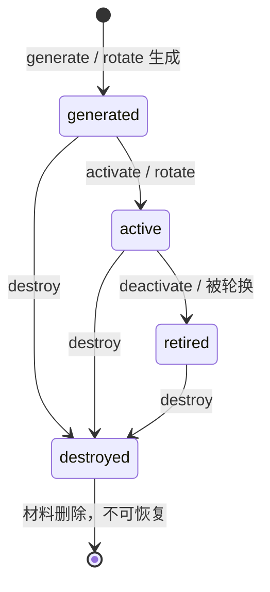

# 密钥版本审计（Key Version Audit）

本地安全数据处理服务（**纯后端，无前端**）。提供密钥版本状态机、按版本权限的
加解密、以及防篡改的审计日志。密钥全部在本地生成，密码原语只使用成熟的
[`cryptography`](https://cryptography.io/)（OpenSSL 后端），**不自创加密算法、
不连接任何生产账号/KMS/HSM**。

## 1. 安全模型与状态机

每个密钥版本有四种状态：



| 状态 | 加密（encrypt） | 解密（decrypt） | 密钥材料 |
|---|---|---|---|
| `generated` | ❌ 拒绝 | ❌（从未用于加密） | 存在（被 KEK 包装） |
| `active` | ✅ 唯一可加密版本 | ✅ | 存在（被 KEK 包装） |
| `retired` | ❌ 拒绝 | ✅ 用于解开历史密文 | 存在（被 KEK 包装） |
| `destroyed` | ❌ 拒绝 | ❌ **明确不可恢复** | **已从磁盘删除** |

规则：

- 任意时刻**至多一个** `active` 版本；`rotate` 原子地把旧 active 置为 `retired`
  并激活新版本。
- 加密只使用 `active` 版本。显式指定其它版本一律 `409 encrypt_version_not_active`。
- 解密不接受调用方指定版本：版本号嵌在密文信封里并绑定为 AEAD 的 AAD，
  服务按信封版本查历史密钥；`retired` 可解，`destroyed` 明确拒绝。
- `destroy` 把被包装的密钥材料从状态文件中删除（仅保留 SHA-256 指纹占位），
  没有任何旁路可以恢复。

### 算法与封装

- 对称加密：**AES-256-GCM**（`cryptography.hazmat.primitives.ciphers.aead.AESGCM`）。
- 每个 DEK（数据加密密钥）是 256 位随机密钥（`AESGCM.generate_key`），
  nonce 为每次加密 `os.urandom(12)`。
- 磁盘上 DEK 由本地随机 KEK（256 位，存于 `kek.key`，权限 0600）以 AES-GCM
  包装后保存。删除/替换 KEK 文件后所有被包装 DEK 无法解开（启动校验即拒绝）。
- 密文信封（`KVA1`）：`MAGIC | 版本号长度 | 版本号 | nonce(12) | 密文+GCM标签`，
  版本号作为 AAD 绑定，换版本号即认证失败。
- 指纹：`SHA-256(DEK)`，仅用于完整性核对，不可逆。

> 这是本地教学/审计用途的合理设计，不是完整 KMS：没有访问控制、多副本或
> HSM 根密钥。KEK 文件与数据同机存放，能防“状态文件被单独拷贝/替换”，
> 不能防整机失陷。

## 2. 目录结构

```
keyversion/
  errors.py     # 错误类型（含 HTTP 状态码映射）
  crypto.py     # AES-256-GCM、KEK 包装、KVA1 信封、指纹
  store.py      # 状态机、原子持久化、哈希链审计日志、文件锁
  service.py    # 加解密权限规则 + 拒绝事件审计
  server.py     # 标准库 http.server JSON API
  __main__.py   # CLI: serve / init / status
tests/          # 51 个 pytest 用例（含 SIGKILL 崩溃恢复）
examples/
  demo_requests.sh   # curl 全流程演示
  api_requests.http  # 请求样例
```

数据目录（默认 `./data`，权限 0700）：

```
data/
  kek.key        # 32B 随机 KEK，0600
  state.json     # 版本元数据 + 被包装 DEK，原子替换写入，0600
  state.json.tmp # 原子写临时文件
  audit.log      # 仅追加 JSONL，SHA-256 哈希链，0600
  .lock          # 跨进程排他文件锁
```

## 3. 快速开始

需要 Python 3.10+（开发于 3.12）。

```bash
python3 -m venv .venv && source .venv/bin/activate    # 可选
pip install -r requirements.txt

python3 -m keyversion --data-dir ./data init           # 初始化并轮换出第一个 active 版本
python3 -m keyversion --data-dir ./data status         # 查看版本
python3 -m keyversion --data-dir ./data --port 8080 serve
```

服务只监听 `127.0.0.1`。完整 curl 演示：

```bash
bash examples/demo_requests.sh 8080
```

## 4. HTTP API 摘要

所有请求/响应为 JSON；二进制密文用 base64。错误响应统一为：

```json
{"error": {"code": "encrypt_version_not_active", "message": "...", "request_id": "..."}}
```

| 方法 | 路径 | 说明 |
|---|---|---|
| GET | `/health` | 健康检查，返回当前 active 版本 |
| POST | `/keys/generate` | 生成 `generated` 版本（不影响 active） |
| POST | `/keys/rotate` | 生成新版本并激活，旧 active 转 `retired` |
| POST | `/keys/{id}/activate` | 激活 generated 版本（旧 active 同步停用） |
| POST | `/keys/{id}/deactivate` | `active -> retired` |
| POST | `/keys/{id}/destroy` | 销毁，删除材料 |
| GET | `/keys` / `/keys/{id}` | 版本列表 / 详情 |
| POST | `/encrypt` | `{"plaintext": "...", "version_id"?}`，默认用 active |
| POST | `/decrypt` | `{"ciphertext": "<base64 KVA1>"}`，版本取自信封 |
| GET | `/audit` | 全部审计条目（读取时校验哈希链） |

`plaintext` 字段：传二进制请用**规范 base64**（带正确填充、往返一致）；
普通文本（如 `"hello"`）按 UTF-8 处理。响应同时返回 base64 与（若可解码）
`plaintext_utf8`。

错误码：`version_not_found(404)`、`invalid_state_transition(409)`、
`no_active_version(409)`、`encrypt_version_not_active(409)`、
`decrypt_version_destroyed(409)`、`decrypt_version_not_usable(409)`、
`invalid_envelope(400)`、`audit_log_tampered(500)`。

## 5. 审计日志

每条目（JSONL）包含：`seq, ts, action, version_id, old_state, new_state,
result, request_id, detail, prev_hash, entry_hash`。

- **哈希链**：`entry_hash = SHA256(prev_hash || 规范化JSON(本条目不hash字段))`，
  启动时与读取 `/audit` 时全链校验；改动/删除中间条目即 `audit_log_tampered`。
- **只追加**：正常运行只 append + fsync；末尾若因崩溃留下半行，启动时截断。
- **无秘密**：日志只记录动作、状态、结果、原因和**长度**；绝不记录明文、
  DEK、KEK 或被包装密钥。成功与**被拒绝**的加解密都会记账
  （`result=success|denied|noop`）。

## 6. 崩溃一致性

状态转换与审计写入在同一把锁（进程内 RLock + 跨进程 `flock`）内串行，
提交顺序为：

1. `state.json.tmp` 写入并 `fsync` → `os.replace` 原子替换 → 目录 `fsync`；
2. `audit.log` 追加一条或多条并 `fsync`。

因此崩溃点只有两种可观察结果：停在旧状态，或停在新状态；`state.json`
不会出现半截 JSON，也不会出现两个 active。最坏情况是状态已提交而最后一
审计条目丢失（只丢审计、状态机仍自洽）。启动时重新校验：状态不变量、
DEK 指纹、KEK 解包、审计哈希链。

## 7. 测试

```bash
python3 -m pytest tests/                      # 全部 51 个用例
python3 -m pytest tests/ -m "not slow"        # 跳过 SIGKILL 子进程用例
```

覆盖：密码原语与篡改/错版本拒绝；状态机全部合法/非法转换；加密权限
（generated/retired/destroyed/未知版本拒绝）；解密历史版本权限；
**交错轮换与加解密**；多线程并发不变量；审计哈希链篡改检测；
审计字节级无秘密扫描；文件权限；**SIGKILL 崩溃后多轮恢复一致性**；
HTTP API 端到端。

实际运行记录见 [RUN_REPORT.md](RUN_REPORT.md)。
